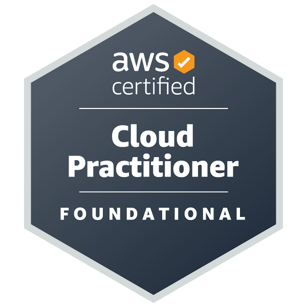

<h1 align="center">Hi, I'm Devarshi Nichite 👋</h1>

  <b align="center">AWS Certified Cloud Practitioner | IT Support Engineer | Cloud & DevOps Enthusiast</b>

  <a href="https://devarshinichite.github.io">🌐 Portfolio</a> |
  <a href="https://www.linkedin.com/in/devarshinichite">💼 LinkedIn</a> |
  <a href="mailto:devarshinichite@yahoo.com">📧 Email</a>

### 👨‍💻 About Me
I'm an **IT Support Engineer transitioning into Cloud & DevOps**, with professional experience supporting systems, troubleshooting infrastructure, managing IT assets, and working with Linux, Windows, networking, and servers.

I'm currently focused on building practical cloud infrastructure skills through **AWS projects, homelabs, and hands-on labs** - with an emphasis on understanding how systems are designed, deployed, secured, and connected.

### 🛠️ Technologies & Tools

  
  
  
  
  
  
  
  

**Cloud:** AWS, EC2, VPC, IAM, S3, RDS  
**Infrastructure:** Linux, Windows Server, Networking, Nginx, Docker, WireGuard  
**Development:** Python, Flask, MySQL, Git, Bash

### ☁️ AWS Certification - AWS Certified Cloud Practitioner - CLF-C02

  
  

### 🚀 Featured Projects

**☁️ [AWS Cloud Journey](https://github.com/devarshinichite/aws-cloud-journey)**  
My ongoing AWS learning repository covering **cloud networking, EC2, VPC architecture, security, RDS, application deployment, architecture diagrams, troubleshooting, and infrastructure documentation.**

**🔐 [Homelab VPN](https://github.com/devarshinichite/aws-cloud-journey/tree/main/Homelab%20VPN)**  
Built a **WireGuard VPN between AWS EC2 and my homelab**, working with Linux networking, routing, firewall rules, VPN peers, and private network access.

**🌐 Reverse Proxy / Application Deployment**  
Deployed a Flask application using **Gunicorn + Nginx on AWS EC2**, gaining hands-on experience with application-to-infrastructure workflow, reverse proxy configuration, HTTP/HTTPS, and Linux services.

**☁️ [Cloud Asset Manager](https://github.com/devarshinichite/cloud-asset-manager)**  
A cloud-focused project exploring **infrastructure and cloud asset management**.

👉 **[View all projects & technical documentation →](https://devarshinichite.github.io/#projects)**

### 💼 Experience

**IT Support Engineer/IT Supervisor - NCC Directorate, Maharashtra**  
6-month contractual role, Systems Administration, Networking, Troubleshooting, Infrastructure Support

Worked with **40+ systems, 50+ IT assets, Windows Server, Active Directory, Group Policy, firewalls, LAN infrastructure, backups, system deployment, and technical troubleshooting.**

---

---

  <i>Building practical cloud infrastructure through hands-on projects, troubleshooting, and continuous learning.</i>

